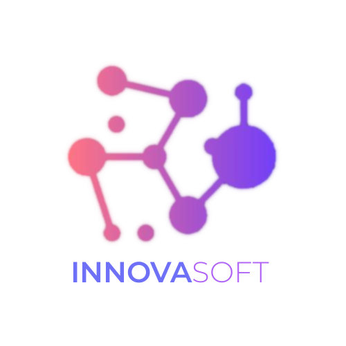

# InnovaSoft - Enterprise AI & Software Solutions

<div align="center">
    
</div>
</div>

<div align="center">

[](https://vercel.com)
[](https://vuejs.org/)
[](https://vitejs.dev/)
[](https://tailwindcss.com/)
[](https://www.python.org/)
[](https://fastapi.tiangolo.com/)

</div>

## 🚀 Despliegue

### Frontend (Vercel)
El frontend está optimizado para desplegarse en Vercel.

### Backend (Digital Ocean)
Debido a los requerimientos de memoria para los embeddings de IA, recomendamos desplegar el backend en Digital Ocean.
👉 **[Ver Guía de Despliegue en Digital Ocean](DEPLOY_DIGITALOCEAN.md)**
 **InnovaSoft-landing** is a high-performance, modern landing page designed for a forward-thinking software development agency specializing in Enterprise AI and tailor-made software solutions. Built with a focus on aesthetics, performance, and user experience, it features a sleek glassmorphism design and a robust, secure backend for client communications.

## Tech Stack

### Frontend
- **Framework:** [Vue.js 3](https://vuejs.org/) (Composition API)
- **Build Tool:** [Vite](https://vitejs.dev/)
- **Styling:** [Tailwind CSS](https://tailwindcss.com/)
- **Icons:** [Lucide Vue](https://lucide.dev/)
- **Animations:** CSS3 & Vue Transitions

### Backend
- **Runtime:** [Python 3.11](https://www.python.org/)
- **Framework:** [FastAPI](https://fastapi.tiangolo.com/)
- **Email Service:** Google Gmail API (OAuth 2.0)
- **Validation:** Pydantic

### Deployment
- **Frontend:** [Vercel](https://vercel.com/)
- **Backend:** [Digital Ocean](https://www.digitalocean.com/) (Docker Container)

## Features

- **Modern UI/UX:** "Sharp Glass" aesthetic with premium glassmorphism effects and smooth animations.
- **Fully Responsive:** Optimized for all devices, from mobile phones to large desktop screens.
- **Interactive Contact Form:**
  - Real-time validation.
  - **Admin Notifications:** Instant email alerts for new leads.
  - **Auto-Replies:** Professional, branded HTML email confirmation sent to the user immediately.
- **Secure Architecture:**
  - OAuth 2.0 authentication for email sending (no less secure apps).
  - Environment variable protection for all sensitive credentials.
  - CORS configured for security.

## Project Structure

```
innovasoft-landing/
├── frontend/           # Vue.js Application
│   ├── src/
│   ├── public/
│   └── vite.config.js
├── backend/            # FastAPI Application
│   ├── routers/        # API Route Handlers
│   ├── services/       # External Services (Gmail)
│   ├── utils/          # Helper Functions & Templates
│   ├── models.py       # Pydantic Models
│   └── main.py         # App Entry Point
├── vercel.json         # Vercel Deployment Config
└── README.md           # Project Documentation
```

---

© 2024 InnovaSoft. All rights reserved.
